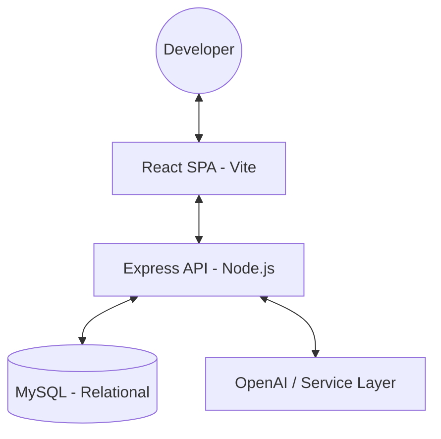

# 🏆 NexusAI | KnowledgeHub — AI-Powered Technical Sharing Platform

[]()
[]()
[]()

**NexusAI | KnowledgeHub** is a high-performance, full-stack platform designed for developers and technical teams to share and discover knowledge efficiently. This project showcases a refined executive dark theme, robust authentication, and cutting-edge AI assistance for content creation.

---

## ✨ Key Features & Technical Highlights

### 🤖 Intelligent AI Ecosystem
*   **"Improve with AI" Engine**: Automatically boosts the quality of articles by refining vocabulary, tone, and grammar. It even suggests a "Viral" technical title for maximum engagement.
*   **Automated Summarization**: Uses NLP to generate concise, indexing-ready summaries for every article, ensuring a clean and scannable Home feed.
*   **Resilient Design**: Features a seamless fallback mechanism to a high-quality mock service if AI API keys are missing, ensuring 100% uptime.

### 🍱 User-Centric Dashboard
*   **Role-Based Access**: Secure CRUD operations protected by JWT-based session tokens.
*   **Private Workspace**: A dedicated dashboard for authors to manage their contributions with real-time synchronization.
*   **Ownership Integrity**: Server-side verification ensures that only the rightful owner can modify or delete their technical insights.

### 🎨 Production-Grade UI/UX
*   **Executive Dark Theme**: Designed for visual comfort and focus, featuring glassmorphism elements, vibrant blue gradients, and responsive layouts.
*   **Rich Text Editor**: Integrated `React Quill` for a professional, "What-You-See-Is-What-You-Get" writing experience.

---

## 🏗️ Technical Architecture

The platform is built on a modular **MVC (Model-View-Controller)** architecture to ensure scalability and maintainability.



### 🛠️ Core Tech Stack
| Tier | Technology Used |
| :--- | :--- |
| **Frontend** | React 18, Vite, Context API, Axios, React Quill |
| **Backend** | Node.js, Express.js |
| **Database** | MySQL (Normalized Schema) |
| **Auth** | JWT (JSON Web Tokens), Bcrypt.js |
| **Styling** | Vanilla CSS (Premium Custom Design System) |

---

## 📂 Project Structure

```text
├── backend/                # Server-side logic (MVC Pattern)
│   ├── controllers/        # Request handlers
│   ├── models/             # Direct DB interactions
│   ├── routes/             # API endpoint definitions
│   ├── services/           # External AI service integration
│   └── config/             # Database & Security configuration
├── frontend/               # Client-side application
│   ├── src/pages/          # Main view components
│   ├── src/components/     # Reusable UI elements
│   └── src/context/        # Global state (Auth)
└── README.md               # Main Documentation
```

---

## 🚀 Getting Started

### 1. Requirements
*   Node.js (v18+)
*   MySQL Instance
*   OpenAI API Key (Optional)

### 2. Quick Install
```bash
# Clone the repository
git clone https://github.com/dilipnalage1063/Knowledge-Sharing-Platform-with-AI-Assist.git

# Install Backend & Database
cd backend && npm install
node seed.js # Initialize with professional test data

# Install Frontend
cd ../frontend && npm install
```

### 3. Run Locally
```bash
# Start Backend (on port 5000)
cd backend && npm start

# Start Frontend (on port 5173)
cd frontend && npm run dev
```

---

## 🔑 Environment Configuration
Create a `.env` file in the `backend/` directory:
```env
DB_HOST=localhost
DB_USER=root
DB_PASS=your_password
DB_NAME=ai_ksp
JWT_SECRET=production_ready_secret
OPENAI_API_KEY=your_key_here
```

---

## 👤 Admin Demo Credentials
For recruiters who wish to explore the dashboard immediately:
- **Email**: `admin@example.com`
- **Password**: `Password123!`

---
*Developed for the CDAC AI-KnowledgeBase Assignment — Final Production Release 2026.*
