# 📄 KnowledgeHub — AI-Powered Knowledge Sharing Platform

**KnowledgeHub** is a high-performance, professional article-sharing platform designed for developers. It leverages cutting-edge AI to assist authors in creating, improving, and summarizing technical content. Built with a robust **Node.js/Express** backend and a sleek **React/Vite** frontend, it follows modern architectural patterns for scalability and visual excellence.

---

## 🏗️ 1. Approach & Architecture

### Architecture Overview
The project follows a modular **Monolithic Service Architecture** with a clear separation of concerns:

```mermaid
graph TB
    subgraph Frontend ["🎨 Client (React + Vite)"]
        UI[User Interface]
        Ctx[Auth Context]
        Svc[Axios Services]
    end

    subgraph Backend ["⚙️ Server (Node.js + Express)"]
        Routes[API Routes]
        Ctrl[Controllers]
        Model[Models]
        AISvc[AI Service Layer]
    end

    subgraph Database ["📊 Data Storage"]
        DB[(MySQL)]
    end

    subgraph External ["🤖 AI Provider"]
        Gemini[Google Gemini API]
    end

    UI <--> Ctx
    UI <--> Svc
    Svc <--> Routes
    Routes --> Ctrl
    Ctrl --> Model
    Model <--> DB
    Ctrl --> AISvc
    AISvc <--> Gemini
```



### AI System Flow
Below is the logic flow for the "Improve with AI" feature:


- **Client (Frontend)**: A React-based Single Page Application (SPA) utilizing Vite for lightning-fast development and build cycles.
- **Server (Backend)**: A Node.js/Express API following the **MVC (Model-View-Controller)** pattern.
- **Database**: Relational MySQL database with a normalized schema to handle sessions, articles, and many-to-many tag relationships.
- **AI Integration**: A dedicated Service Layer integrating **Google Gemini** for real-time content enrichment.

### Key Design Decisions
1.  **Native Gemini SDK Integration**: Switched from generic OpenAI wrappers to the native `@google/generative-ai` SDK to ensure 100% stability and access to low-latency Flash models.
2.  **Stateless JWT Authentication**: Implemented secure JSON Web Tokens for session management, stored in local storage with automatic request injection via Axios interceptors.
3.  **Ownership Verification Middleware**: Custom server-side guards ensure that while anyone can read, only the original author or an admin can modify/delete content.
4.  **Premium UX/UI**: Prioritized a high-contrast dark theme with glassmorphism effects and inline AI feedback loops instead of intrusive dialogs.

### 📂 Folder Structure
```text
├── backend/                # Server-side logic
│   ├── config/             # DB & Environment setup
│   ├── controllers/        # Business logic & request handling
│   ├── middleware/         # Auth, Uploads, Error guards
│   ├── models/             # Database abstractions (Raw SQL + mysql2)
│   ├── routes/             # API Endpoint definitions
│   └── services/           # AI Logic (Gemini Native SDK)
├── frontend/               # Client-side logic
│   ├── src/context/        # Global State (AuthContext)
│   ├── src/pages/          # Main Views (Dashboard, Editor, Detail)
│   ├── src/components/     # UI Parts (Navbar, ProtectedRoutes)
│   └── src/services/       # API interaction layer (Axios)
└── README.md               # Root Documentation
```

---

## 🤖 2. AI Usage (Mandatory)

This project was developed with a "Human-in-the-loop" AI approach, primarily using **Gemini 2.0 Flash** and **Antigravity (Advanced Agentic AI)**.

### Where AI Helped:
-   **Code Generation**: Scaffolding the initial Express controllers and the complex `ArticleEditor` state management.
-   **Refactoring**: Transitioning the AI Service from a failing OpenAI-compatible wrapper to the robust **Native Gemini SDK**.
-   **SQL Queries**: Designing the normalized table structure for articles and the junction table for tags to prevent data duplication.
-   **API Design**: Structuring the RESTful endpoints for the AI assistant and ensuring consistent JSON response formats.
-   **UI Ideas**: Implementing the **AI Preview Panel** (inline confirmation) and choosing the modern Indigo/Purple dark-mode palette.

### Manual Corrections & Enhancements:
-   **Safe JSON Parsing**: Manually implemented a robust parser to strip markdown code fences (` ```json `) returned by LLMs that were crashing standard `JSON.parse()` calls.
-   **Prompt Engineering**: Optimized system instructions for "Improve with AI" to guarantee emoji-rich markdown headings and professional "Pro-Tip" callouts.
-   **Auth Integrity**: Corrected token expiration handling in the `AuthContext` to ensure smooth user logout transitions.

---

## ✨ Features
-   **✨ AI Content Improvement**: Enrich your articles with emoji headings and improved flow.
-   **📝 Auto-Summarization**: Generate catchy 2-sentence teasers for the article feed.
-   **🏷️ Smart Tagging**: AI suggests 4-6 relevant tags based on your title and category.
-   **🔐 Secure Auth**: JWT-protected signup/login with Bcrypt password hashing.
-   **📱 Fully Responsive**: Seamless experience across mobile, tablet, and desktop.

---

## 🚀 Getting Started

### Prerequisites
- Node.js (v18+)
- MySQL Instance
- Gemini API Key

### Installation
1.  **Clone the Repo**: `git clone https://github.com/dilipnalage1063/Knowledge-Sharing-Platform-with-AI-Assist.git`
2.  **Backend Setup**: 
    - `cd backend && npm install`
    - Configure `.env` with DB and API keys.
    - Run `node seed.js` to initialize the database.
3.  **Frontend Setup**:
    - `cd ../frontend && npm install`
4.  **Run Development**:
    - Backend: `npm start`
    - Frontend: `npm run dev`

---
*Created as part of the AI Knowledge Platform Assignment — 2026.*
